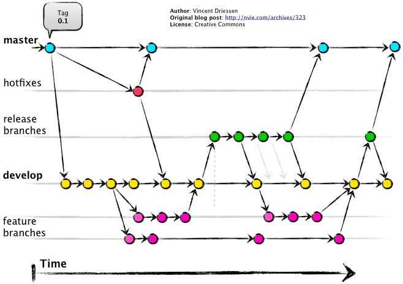
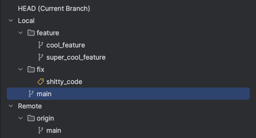

# Git

Git is a free and open source distributed version control system designed to handle everything from small to very large
projects with speed and efficiency.

# Version Control System

VCS is a system that records changes to a file or set of files over time so that you can recall specific versions later.

# Git Flow

Git Flow is a Git workflow designed around project releases. Git Flow defines a strict branching model designed around
the project release. This provides a robust framework for managing larger projects.
For example, you can use:

- **main** branch for production.
- **develop** branch for development.
- **feature** branches for new features.
- **fix** branches for bug fixes.
- **tech** branches for technical tasks.

# Branch naming

It's a good practice to use naming convention for branches. For example:

- **feature/some_feature_name** or **feature/some-feature-name**
- **fix/cool_fix_name** or **fix/cool-fix-name**

In that case you can easily find a branch by name. 'feature' and 'fix' represent branch 'folders' in the repository.

# Git commands cheat sheet

- **git init** - initialize a new repository.
- **git clone url_to_remote_repo** - clone a repository that already exists on GitHub,
  including all the files, branches, and commits.
- **git status** - check the status of your working directory and staging area.
- **git add path/to/file.ext** - add all changes in your working directory to the staging area. You can add specific
  files by specifying
  their path. Instead of a file path, you can also use a dot (.) to add all files in the current directory.
- **git commit** - commit changes, so they’re part of the project history.You can add -m flag to add a commit message
  in one line. You can add -a flag
  to automatically stage files that have been modified and deleted, but new files you have not told Git about are not
  affected.
- **git push** - push changes to remote repository to the current branch. You can add name of the branch after the
  command e.g. **git push origin main** or **git push origin feature/some_feature_name**.
- **git pull** - fetch and download content from a remote repository and immediately update the local repository to
  match that content. You can add name of the branch after the command e.g. **git pull origin main** or **git pull
  origin feature/some_feature_name**.
- **git checkout branch_name** - switch to another branch. You can use -b flag to create a new branch and switch to it
  e.g. **git checkout -b feature/some_feature_name**.

Also, you can use IDE integration for Git. For example, in IntelliJ IDEA you can use 'VCS/Git' menu for common Git
actions
or 'Get from VCS' on create new project screen to fetch a project from a remote repository.

# Homework

## Git flow

- Fetch this repository to your local machine.
- Create a new branch 'lesson/lesson_2' using terminal or IDE.
- Add your old homework to associated folders in the repository.
- When you finish, add, commit and push your changes to the remote repository.
- Create a pull request to the main branch with description of your changes.

## Fibonacci

In another branch create a function that recursively calculates the Fibonacci number.
The function should take one argument - the index of the Fibonacci number.
The function should return the Fibonacci number for the given index.
Example:

- fibonacci(1) // returns 1
- fibonacci(5) // returns 5
- fibonacci(10) // returns 55
- fibonacci(15) // returns 610